<a name="readme-top"></a>

<div align="center">

# 🏥 Healthcare Appointment & Follow-up Manager

**A clinic platform with patient, doctor, and admin portals — conflict-safe booking, AI visit summaries, and automatic email + calendar sync.**


</div>

---

<details>
<summary>📑 Table of Contents</summary>

- [Overview](#overview)
- [Demo Video](#demo-video)
- [At a Glance](#at-a-glance)
- [Key Features](#key-features)
- [Bonus Features](#bonus-features)
- [Tech Stack](#tech-stack)
- [System Architecture](#system-architecture)
- [System Design](#system-design)
- [Database Schema](#database-schema)
- [API Documentation](#api-documentation)
- [LLM Integration & Prompts](#llm-integration--prompts)
- [Email & Google Calendar Integration](#email--google-calendar-integration)
- [Setup Guide](#setup-guide)
- [Environment Variables](#environment-variables)
- [Deployment](#deployment)
- [Evaluation Focus Mapping](#evaluation-focus-mapping)
- [Screenshots](#screenshots)

</details>

---

## Overview

Clinics need more than a booking form. Patients want to describe what's wrong before they arrive and get reminded to take their medication afterward. Doctors want a quick, structured brief before walking into the room instead of re-reading a form on the spot. Both sides want confirmation they can trust — in their inbox and on their calendar — without anyone double-booked or left in the dark when a doctor is suddenly unavailable.

This project builds that system end-to-end: role-based booking across patient, doctor, and admin portals; an LLM-generated urgency triage before each visit and a plain-language recap after it; concurrency-safe slot holds; leave-day conflict handling that notifies rather than silently reschedules; and a durable notification layer that survives a flaky SMTP provider.

```bash
# TL;DR — see Setup Guide below for env vars and first-time admin creation
cd server && npm install && npm run dev     # terminal 1
cd client && npm install && npm run dev     # terminal 2
```

---

## Demo Video

[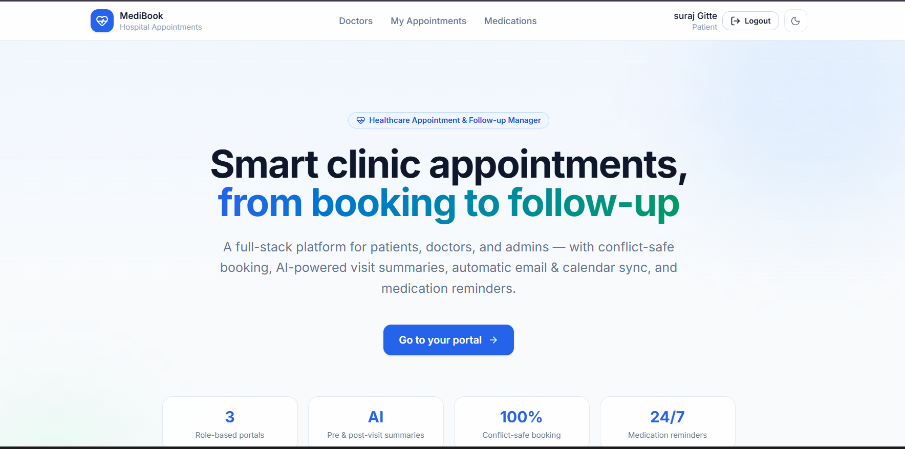](https://drive.google.com/file/d/1BTn8Giir67S2scucnzaV9vtlvQ9gio32/view?usp=sharing)

🔗 Or watch directly: [https://drive.google.com/file/d/1BTn8Giir67S2scucnzaV9vtlvQ9gio32/view?usp=sharing](https://drive.google.com/file/d/1BTn8Giir67S2scucnzaV9vtlvQ9gio32/view?usp=sharing)

<!-- Replace YOUR_VIDEO_ID (both places above) with your actual YouTube video ID — the part after `v=` in your video's URL. -->

---

## At a Glance

|                       |                                                                            |
| --------------------- | -------------------------------------------------------------------------- |
| **Roles**             | Patient · Doctor · Admin                                                   |
| **Booking safety**    | MongoDB partial unique index + TTL (no Redis, no lock service)             |
| **AI summaries**      | Pre-visit (urgency triage) + post-visit (patient-friendly recap)           |
| **LLM providers**     | OpenAI (`gpt-4o-mini`) primary → Groq (`llama-3.3-70b-versatile`) fallback |
| **Notifications**     | Email (Nodemailer) with exponential-backoff retry                          |
| **Calendar**          | Google Calendar, admin-level OAuth, patients added as attendees            |
| **Extras**            | Medication autocomplete (RxNav API), light/dark theme toggle, admin analytics dashboard |
| **Deployment target** | Render (persistent process required for `node-cron`)                       |

---

## Key Features

### 🧑 Patient

- Register, search doctors by specialization, view live slot availability
- Hold a slot → submit symptoms → confirm — with email + Calendar invite on confirmation
- View appointments (pending / confirmed / cancelled / completed), cancel their own bookings
- Get notified and rebook if a doctor cancels for leave
- Read the AI-generated post-visit summary and medication schedule

### 🩺 Doctor

- View an appointment queue, sortable by date and status
- See the AI pre-visit summary (urgency level, chief complaint, suggested questions) before each visit
- Submit clinical notes + structured prescription — the patient-facing summary and medication reminders are generated automatically
- Auto-complete drug names from the RxNav API while prescribing, instead of free-typing (see [Bonus Features](#bonus-features))
- Mark leave days — conflicting appointments are cancelled and patients notified automatically

### 🛡️ Admin

- Create and manage doctor profiles (specialization, working hours, slot duration)
- Mark leave on behalf of any doctor, with the same conflict-safe cascade
- View a platform-wide analytics dashboard — all patients, doctors, and appointments at a glance (see [Bonus Features](#bonus-features))

---

## Bonus Features

Beyond the core PS scope, a few extras were added:

### 💊 Medication Autocomplete — RxNav (NLM) API

Prescription entry is typeahead-searched against the National Library of Medicine's [RxNav REST API](https://rxnav.nlm.nih.gov/REST) instead of free-text. As the doctor types a drug name, the frontend queries RxNav's drug-name/approximate-match endpoints and shows matching RxNorm names to pick from — cutting typos, speeding up prescribing, and keeping drug names consistent for the post-visit LLM summary and the medication-reminder scheduler.

### 🎨 Theme Toggle

The UI supports a light/dark theme toggle (Tailwind `dark:` strategy), persisted per user, so patients and doctors can use whichever is easier on the eyes.

### 📊 Admin Analytics Dashboard

Beyond doctor CRUD and leave management, the admin portal has a dashboard giving a platform-wide view — total patients, doctors, appointment counts by status, and recent activity — instead of digging through individual records.

---

## Tech Stack

| Layer          | Technology                                                       |
| -------------- | ---------------------------------------------------------------- |
| Frontend       | React (Vite), Tailwind CSS, React Router, Axios, react-hook-form |
| Backend        | Node.js, Express, JWT, bcrypt                                    |
| Database       | MongoDB + Mongoose                                               |
| AI             | OpenAI SDK, Groq SDK                                             |
| Drug lookup    | RxNav REST API (NLM)                                              |
| Notifications  | Nodemailer (SMTP)                                                |
| Calendar       | Google Calendar API (googleapis)                                 |
| Scheduled jobs | node-cron                                                        |
| Hosting        | Render                                                           |

---

## System Architecture

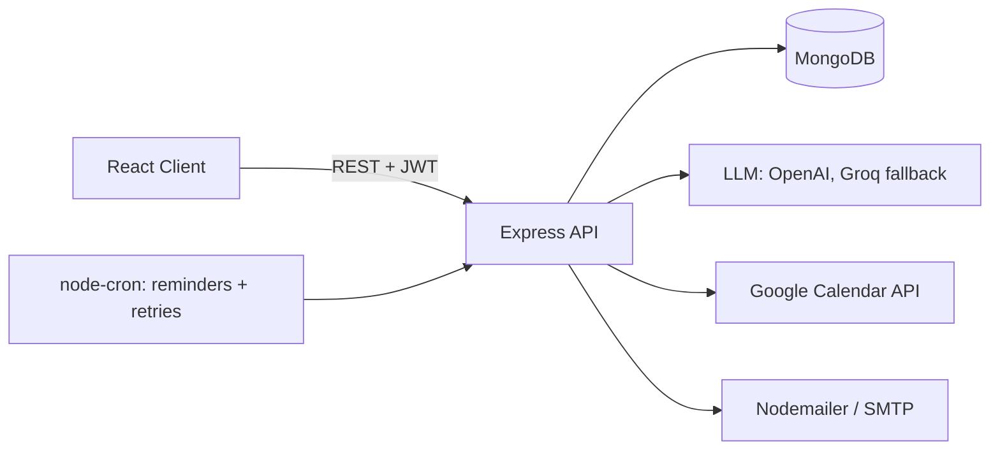

_The API is the single point of truth — the client never talks to Mongo, the LLM providers, Calendar, or SMTP directly, keeping every side effect auditable and consistently error-handled in one place._

---

## System Design

_Covers the four required areas: double-booking prevention, slot hold mechanism, doctor leave conflict handling, and notification failure handling._

### Double-Booking Prevention

**TL;DR:** enforced by a database index, not application logic.

The system does not rely on read-then-write checks before booking — under concurrent requests that pattern is inherently racy, since two requests can both read "slot is free" a moment before either writes. Instead, the guarantee is a **partial unique index** on `Appointment{doctorId, slotStart}`, scoped to documents where `status` is `pending` or `confirmed`. When two booking attempts hit the same doctor and slot at the same time, MongoDB itself rejects the second insert with an `E11000` duplicate key error — regardless of how many Node processes are handling requests concurrently. The API layer catches that error and returns a clean `409 Slot already taken`. No distributed lock service is needed; correctness comes from one atomic index rather than coordination between servers.

### Slot Hold Mechanism

**TL;DR:** a temporary `pending` appointment, auto-expired by MongoDB itself.

Booking isn't a single atomic step — a patient picks a slot, fills a symptom form, then confirms. Without a hold, another patient could grab the same slot mid-form. Picking a slot creates an `Appointment` with `status: 'pending'` and `expiresAt` five minutes out. This pending document is protected by the _same_ partial unique index above, so a hold blocks other bookings exactly like a confirmed one — no separate locking mechanism needed. A **TTL index** on `expiresAt` (scoped to `pending`) has MongoDB automatically delete abandoned holds once the window lapses, with no cron cleanup job required. If the patient confirms after expiry, the query (`status: 'pending' AND expiresAt > now`) matches nothing, and the API returns `410 Gone`, sending the client back to pick a fresh slot.

### Doctor Leave Conflict Handling

**TL;DR:** cancel + notify, never silently auto-reschedule.

Marking a leave day immediately queries every `Appointment` for that doctor on that date with `status` in `pending`/`confirmed`, transitions each to `cancelled_leave` with an explicit `cancelReason`, deletes the corresponding Google Calendar event, and creates a `leave_notice` notification per affected patient. The system deliberately does **not** auto-rebook patients — picking a replacement time is a judgment call the patient should make, not a heuristic the system should guess at. Every cancelled appointment carries a reason and a notification record, keeping the path simple and fully auditable.

### Notification Failure Handling

**TL;DR:** persist first, send second, retry with backoff.

Email delivery is treated as unreliable by design — SMTP can be slow, rate-limited, or temporarily down — so no user-facing action blocks waiting for a send to succeed. Every outbound message is persisted as a `Notification` document before any send attempt. If the immediate attempt fails, it's marked `failed` with an incremented `attempts` counter and a `nextRetryAt` computed via exponential backoff (1 min → 5 min → 15 min → 1 hr → 6 hr). A `node-cron` job sweeps due, failed notifications every five minutes and retries them; after five exhausted attempts the record stays `failed` permanently, leaving a clear audit trail instead of silent data loss.

---

## Database Schema

`User` · `DoctorProfile` · `Appointment` · `PreVisitSummary` · `PostVisitSummary` · `MedicationReminder` · `Notification`

| Index                                               | Purpose                      |
| --------------------------------------------------- | ---------------------------- |
| `Appointment{doctorId, slotStart}` — partial unique | Double-booking guard         |
| `Appointment{expiresAt}` — TTL                      | Auto-expires abandoned holds |
| `Notification{status, nextRetryAt}`                 | Retry sweep query            |
| `MedicationReminder{active, endDate}`               | Reminder sweep query         |

📄 Full field-by-field detail: [`docs/DB_SCHEMA.md`](./docs/DB_SCHEMA.md)

---

## API Documentation

| Prefix          | Role    | Covers                                                                 |
| --------------- | ------- | ---------------------------------------------------------------------- |
| `/api/auth`     | public  | register (patient only), login, refresh, logout                        |
| `/api/admin`    | admin   | doctor CRUD, leave management (cancels + notifies)                     |
| `/api/doctor`   | doctor  | appointment queue, pre-visit summary, post-visit completion            |
| `/api/patients` | patient | doctor search, availability, hold/symptoms/confirm/cancel, medications |

Every response follows `{ success, data?, message? }`; errors follow `{ success: false, message, code? }`.

📄 Full endpoint reference with request/response examples: [`docs/API_ROUTES.md`](./docs/API_ROUTES.md)

---

## LLM Integration & Prompts

**Pre-visit summary:**

> Analyse these symptoms and return: urgency level (Low / Medium / High), chief complaint, and three suggested questions for the doctor. Symptoms: `<symptoms>`

**Post-visit summary:**

> Convert these clinical notes into a patient-friendly summary with medication schedule and follow-up steps: `<notes>`

Both prompts force JSON-mode structured output. **OpenAI (`gpt-4o-mini`)** is called first; on any failure (rate limit, network error, malformed JSON), the system falls back to **Groq (`llama-3.3-70b-versatile`)**. If both fail, the record is saved with `llmStatus: 'failed'` and the request still succeeds — an LLM outage never blocks a booking or a completed visit. Medication reminders are always derived from the doctor's structured prescription fields, never parsed from generated text.

---

## Email & Google Calendar Integration

**Email** (Nodemailer/SMTP) covers four events: `booking_confirmation`, `reminder`, `cancellation`, `leave_notice` — each persisted and retried per the failure-handling design above.

**Calendar** uses a single admin-level OAuth connection rather than per-patient consent — patients are added as **attendees by email**, so Google handles sending them the invite, update, or cancellation directly.

**Setup steps:**

1. In [Google Cloud Console](https://console.cloud.google.com), create a project and enable the **Google Calendar API**.
2. Under **APIs & Services → Credentials**, create an **OAuth client ID** (type: Web application).
3. Copy the **Client ID** and **Client Secret** into `server/.env`.
4. Generate a refresh token once via [Google's OAuth Playground](https://developers.google.com/oauthplayground): use your own credentials, request scope `https://www.googleapis.com/auth/calendar`, authorize, and copy the refresh token.
5. Put that value in `GOOGLE_REFRESH_TOKEN` — this single token authenticates calendar access for every appointment, with no per-patient OAuth ever required.

---

## Setup Guide

### Prerequisites

- Node.js 18+
- MongoDB (Atlas or local)
- OpenAI API key, Groq API key
- Google Cloud project with Calendar API enabled
- SMTP credentials (Gmail app password, Mailtrap, SendGrid, etc.)

### Install

```bash
git clone <your-repo-url>
cd <repo>
cd server && npm install
cd ../client && npm install
```

### First-time admin account

There's no public admin/doctor signup — `POST /auth/register` always creates a `patient`. Bootstrap the first admin with a one-time `server/scripts/seedAdmin.js` script that inserts a `User` doc with `role: 'admin'` (bcrypt-hash the password), then delete/disable the script. Create doctors afterward through the admin portal.

### Run locally

```bash
# terminal 1
cd server && npm run dev

# terminal 2
cd client && npm run dev
```

---

## Environment Variables

<details>
<summary><code>server/.env</code></summary>

```env
PORT=5000
MONGO_URI=
JWT_ACCESS_SECRET=
JWT_REFRESH_SECRET=
OPENAI_API_KEY=
GROQ_API_KEY=
GOOGLE_CLIENT_ID=
GOOGLE_CLIENT_SECRET=
GOOGLE_REDIRECT_URI=
GOOGLE_REFRESH_TOKEN=
SMTP_HOST=
SMTP_PORT=
SMTP_USER=
SMTP_PASS=
FRONTEND_URL=http://localhost:5173
```

</details>

<details>
<summary><code>client/.env</code></summary>

```env
VITE_API_BASE_URL=http://localhost:5000/api
```

</details>

---

## Deployment

- **Backend** (Render Web Service): root `server/`, build `npm install`, start `npm start`, all `server/.env` vars set in the Render dashboard.
- **Frontend** (Render Static Site or Vercel): root `client/`, build `npm run build`, publish dir `dist`, `VITE_API_BASE_URL` pointed at the deployed backend.
- Update `FRONTEND_URL` (backend) and the Google OAuth redirect URI once both are live.

**🔗 Live app:** https://health-care-mf-system-git-deployment-suraj-gittes-projects.vercel.app/

---

## Evaluation Focus Mapping

| Evaluation Focus                                          | Where to look                                                                    |
| --------------------------------------------------------- | -------------------------------------------------------------------------------- |
| Slot conflict, leave management, notification reliability | [System Design](#system-design)                                                  |
| LLM prompt quality and failure handling                   | [LLM Integration & Prompts](#llm-integration--prompts)                           |
| Database schema design                                    | [Database Schema](#database-schema), `docs/DB_SCHEMA.md`                         |
| API design and code structure                             | [API Documentation](#api-documentation), `docs/API_ROUTES.md`, `docs/BACKEND.md` |
| Email and Google Calendar integration                     | [Email & Google Calendar Integration](#email--google-calendar-integration)       |
| Documentation                                             | This file + `docs/`                                                              |

---

## Screenshots

Screenshots are stored in [`Project_Images/`](./Project_Images/).

**Landing & theme**

|                  Landing page                   |                   Dark theme                   |
| :---------------------------------------------: | :--------------------------------------------: |
|  | 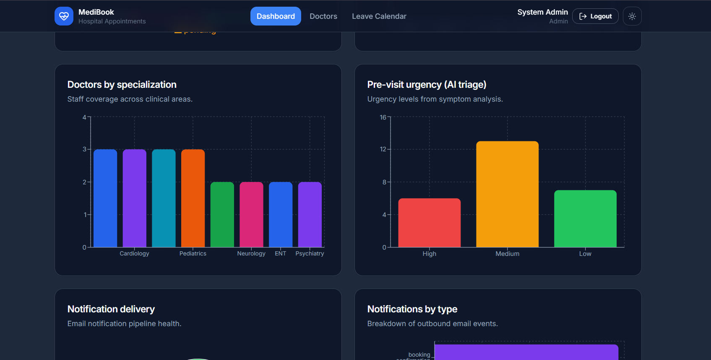 |

**Patient portal**

|                    Find doctors                    |                     My appointments                     |                   Medications                    |
| :------------------------------------------------: | :-----------------------------------------------------: | :----------------------------------------------: |
| 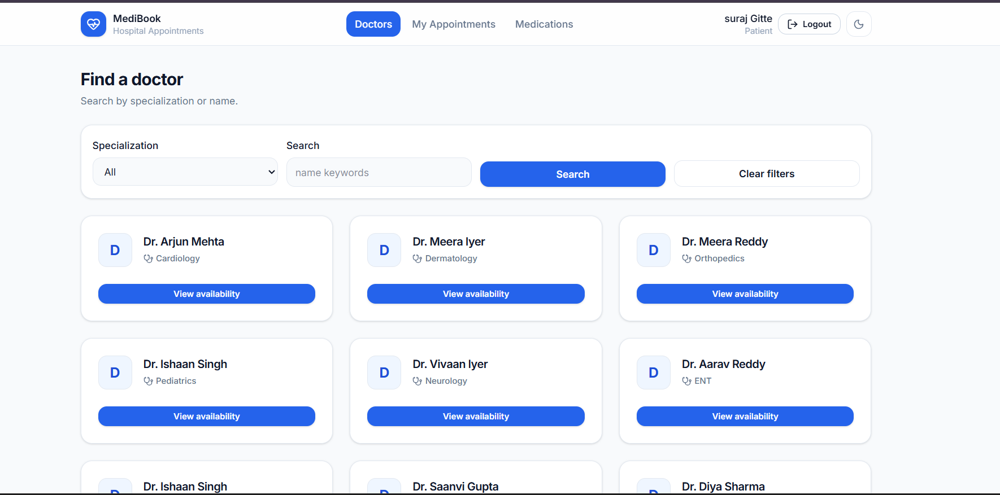 | 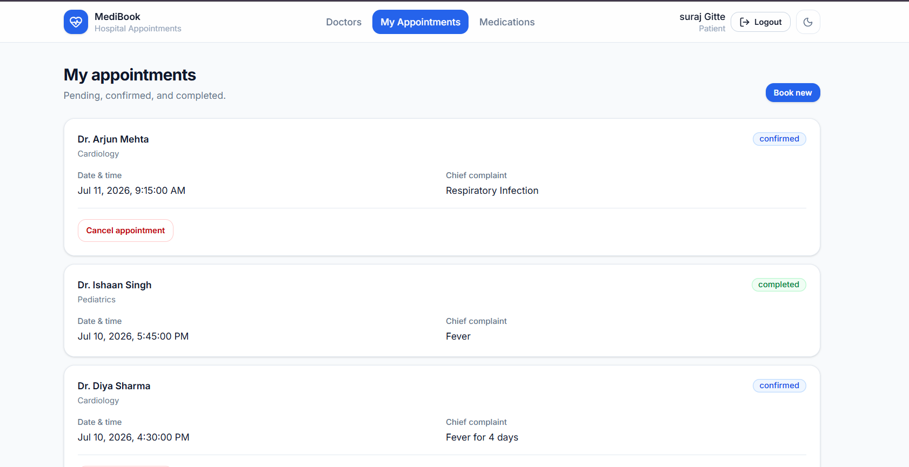 | 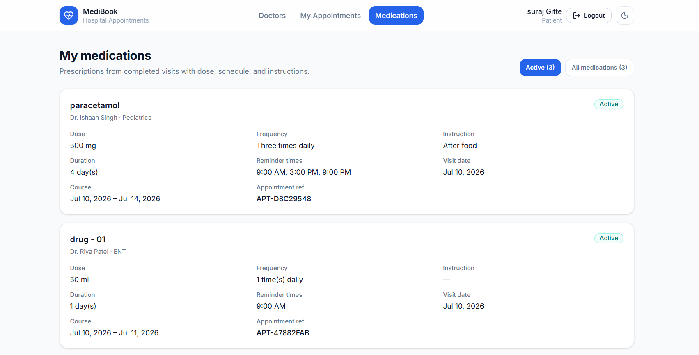 |

**Doctor portal**

|                      Doctor dashboard                       |                         AI pre-visit questions                         |                        Auto-fill prescription                         |
| :---------------------------------------------------------: | :--------------------------------------------------------------------: | :-------------------------------------------------------------------: |
| 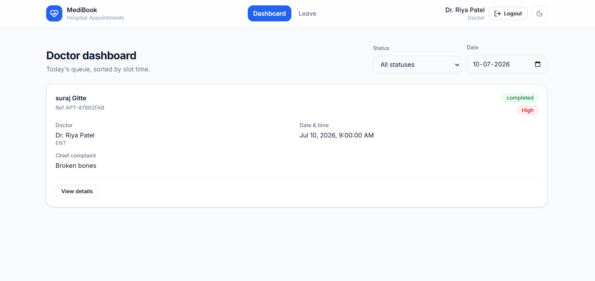 | 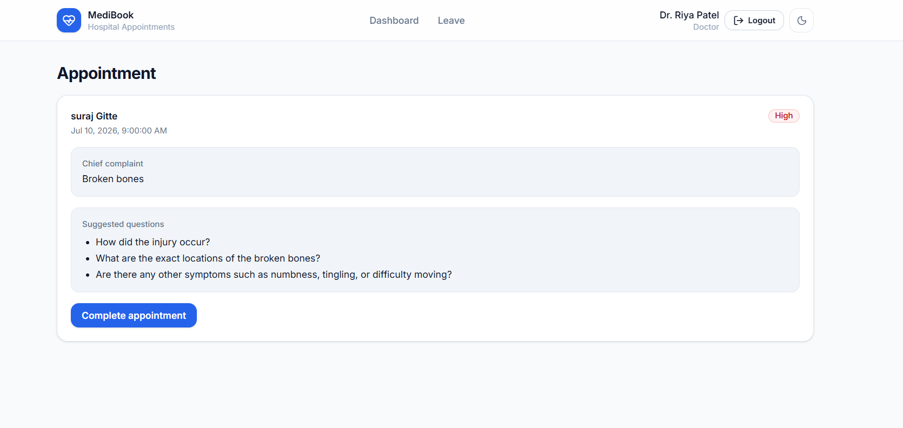 | 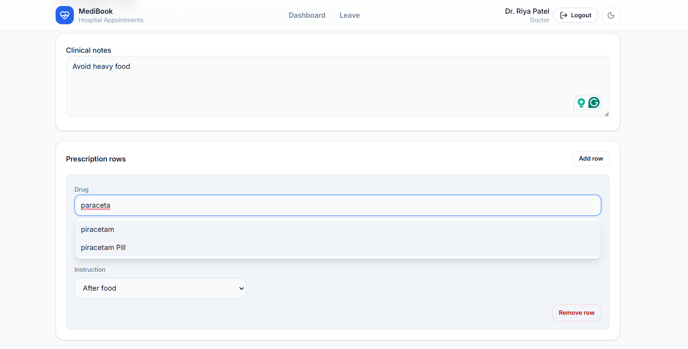 |

**Admin portal**

|                     Admin dashboard                      |                   Edit doctors                    |                     Leave calendar                     |
| :------------------------------------------------------: | :-----------------------------------------------: | :----------------------------------------------------: |
| 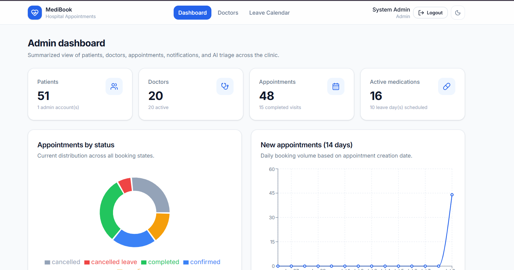 | 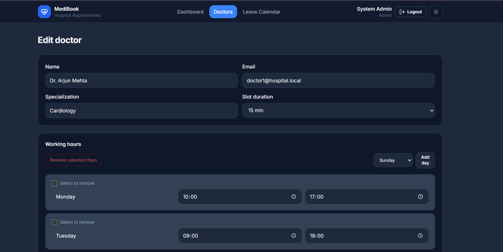 | 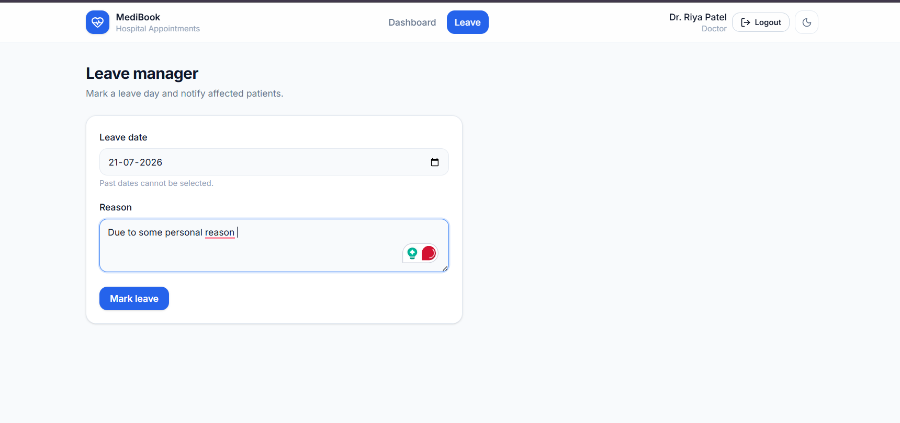 |

<p align="right">(<a href="#readme-top">back to top</a>)</p>